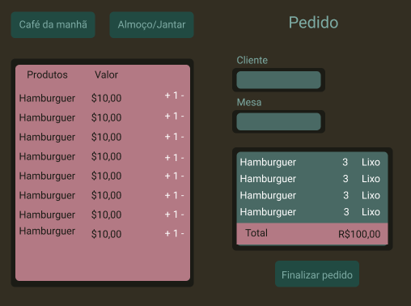
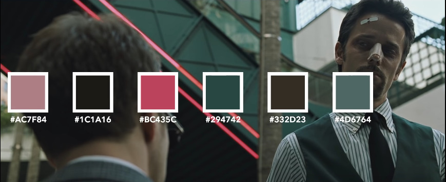

   

## :round_pushpin: Índice

* [1. Sobre o projeto](#1-sobre-o-projeto)
* [2. Histórias de usuários](#2-histórias-de-usuários)
* [3. Layout](#3-layout)
* [4. Experiência dos usuários](#4-experiência-dos-usuários)
* [5. Conteúdos abordados](#5-conteúdos-abordados)
* [6. Autoras](#7-autoras)

---

## 1. Sobre o projeto  :computer:

 Esta é uma aplicação que permite à qualquer funcionário do restaurante Fight Club Burguer criar uma conta de acesso com suas respectivas credenciais (atendente ou chef de cozinha) e logar-se com ela.
 Através da mesma, realizar pedidos utilizando um tablet, e enviá-los para a cozinha para que sejam preparados de forma ordenada e eficiente.

O projeto foi realizado no  _bootcamp_ da [LABORATÓRIA](https://www.laboratoria.la/br).
Acesse aqui a [aplicação](https://fight-club-burger.netlify.app/) :computer_mouse:

## 2. Histórias de usuários :receipt:

Uma história do usuário é uma explicação informal e geral sobre um recurso de software escrita a partir da perspectiva do usuário final. Seu objetivo é articular como um recurso de software pode gerar valor para o cliente.

**Primeira História de Usuário**
>Eu, como garçom/garçonete quero entrar no sistema de pedidos. 

**Segunda História de Usuário**
> Eu como garçom/garçonete quero poder anotar o pedido de um cliente para não depender da minha memória, saber quanto cobrar e poder enviar os pedidos para a cozinha para serem preparados em ordem.

**Terceira História de Usuário**
>Eu como chefe de cozinha quero ver os pedidos dos clientes em ordem, poder marcar que estão prontos e poder notificar os garçons/garçonetes que o pedido está pronto para ser entregue ao cliente. 

**Quarta História de Usuário**
>Eu como garçom/garçonete quero ver os pedidos que estão prontos para entregá-los rapidamente aos clientes.

## 3. Layout :art:

### Protótipo de baixa fidelidade :floppy_disk:
O protótipo foi criado a partir das histórias do usuário, pensando na experiencia  do mesmo com o produto.
Os esboços foram feitos já traçando a responsividade da tela, e projetados primeiramente para Mobile. 
Abaixo temos exemplos das telas home, login, cadastro e menu. 

   

   

   

   

### Paleta de cores :purple_circle: :black_circle: :large_blue_circle: :brown_circle: :white_circle:

 Para o layout, pensamos em uma paleta de cores que remete à temática do restaurante que homenageia o filme Fight Club. Tivemos a preocupação de buscar misturas equilibradas, com o uso dos tons mais escuros, como as cores principais, permitindo explorar diferentes texturas e combinações.

   

### Demonstração da Aplicação :file_folder:

Por meio de gifs vamos demonstrar a usabilidade do nosso produto em formato Tablet:

**Demonstração pagina de cadastro**

inserir gif

**Demonstração pagina de login**

inserir gif

**Demonstração pagina de menu**

inserir gif

**Demonstração pagina da cozinha**

inserir gif

**Demonstração pagina de pedidos finalizados**

inserir gif

## 4. Experiência dos usuários :right_anger_bubble:

#### Testes de usabilidade

A cada entrega de história de usuário fizemos testes de usabilidade. A partir desses testes verificamos a necessidade de fazer alterações na pagina de menu: nas cores e tamanho das fontes e ajustes nas mensagens de erro ao cadastrar.
Melhoramos também o design da aplicação, padronizando as fontes e cores do feed, proporcionando assim uma experência visual mais agradável para os usuários.

## 5. Conteúdos abordados :trophy:

**React**
* jsx

* components

* events

* lists-and-keys

* conditional-rendering

* lifting-up-state

* hooks

* css-modules

* routing

**HTML**
* Uso de HTML semântico

**CSS**
* Utilização do Sass

* Uso de seletores de CSS

* Empregar o modelo de caixa (box model): borda, margem, preenchimento

* Uso de flexbox en CSS

* Uso de CSS Grid Layout

* Uso de media queries

**JavaScript**
* Uso ES modules

* Uso de linter (ESLINT)

* Uso de identificadores descritivos (Nomenclatura | Semântica)

**Git e GitHub**
* Git: Instalação e configuração

* Git: Controle de versão com git (init, clone, add, commit, status, push, pull, remote)

* Git: Integração de mudanças entre ramos (branch, checkout, fetch, merge, reset, rebase, tag)

* GitHub: Criação de contas e repositórios, configuração de chave SSH

* GitHub: Implantação com GitHub Pages

* GitHub: Colaboração pelo Github (branches | forks | pull requests | code review | tags)

* GitHub: Organização pelo Github (projects | issues | labels | milestones | releases)

**HTTP**
* Solicitações o requisições (request) e respostas (response).

* Cabeçalhos (headers)

* Corpo (body)

* Verbos HTTP

* Codigos de status de HTTP

* Encodings e JSON

* CORS (Cross-Origin Resource Sharing)

**UX (User eXperience)**
* Desenhar a aplicação pensando e entendendo o usuário

* Criar protótipos para obter feedback e iterar

* Aplicar os princípios de desenho visual (contraste, alinhamento, hierarquia)

* Planejar e executar testes de usabilidade

## 6. Autoras :woman_technologist:
### Giuliana :woman_artist:
[@Giuthamie](https://github.com/Giuthamie)  [Linkedin](https://www.linkedin.com/in/giuliana-thami%C3%AA/)

### Vanessa :woman_artist:
[@vanessa-cl](https://github.com/vanessa-cl)  [Linkedin](https://www.linkedin.com/in/vanessa-lima20-/)

---

Acesse aqui a [Fight Club Burger](https://fight-club-burger.netlify.app/) :computer_mouse:
